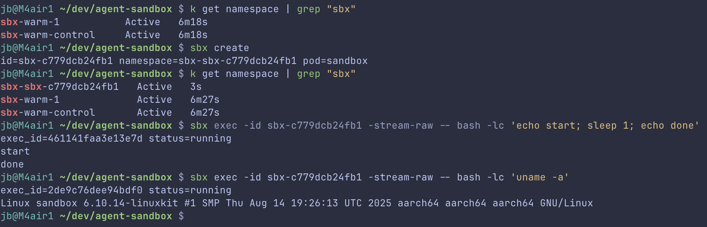
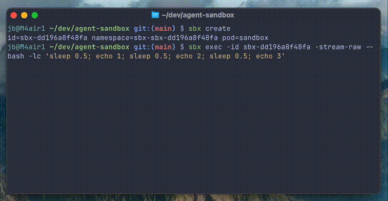

# Agent Sandbox

This repo contains a minimal control plane and CLI that create a sandbox Pod on a local Kubernetes cluster and allow command execution via HTTP.




## Basic Overview
- Control plane is a HTTP server that manages sandboxes
- Data plane is a Kubernetes cluster that runs the sandboxes
- Execs are async by default; stdout/stderr is streamed over WebSocket

## Prereqs
- Go 1.22+
- `kubectl`
- A local Kubernetes cluster (recommended: `kind`)

## Quickstart (Local Dev)
1. Start kind:
   ```bash
   make kind-up
   ```
2. Build and load images:
   ```bash
   make image-base
   make image-sidecar
   ```
3. Edit local config:
   ```bash
   $EDITOR dev/config.yaml
   ```
   Note: `stream_endpoint` uses `host.docker.internal` for macOS. On Linux, set it to your host IP.
4. Run control plane with dev config:
   ```bash
   make run CONFIG=dev/config.yaml
   ```
5. Create a sandbox:
   ```bash
   go run ./cli/cmd/sbx create
   ```
   The returned `id` is the sandbox namespace to use for `exec` and `delete`.
6. Exec a command:
   ```bash
   go run ./cli/cmd/sbx exec -id <ID_FROM_CREATE> -- bash -lc 'uname -a'
   ```
7. Delete the sandbox:
   ```bash
   go run ./cli/cmd/sbx delete -id <ID_FROM_CREATE>
   ```

## Configuration
- `SANDBOX_IMAGE` (default: `ubuntu:22.04`)
- `SANDBOX_VOLUME_MODE` (`emptydir` or `pvc`, default: `emptydir`)
- `SANDBOX_CACHE_MODE` (`emptydir`, `hostpath`, or `pvc`, default: `emptydir`)
- `SANDBOX_CACHE_HOSTPATH` (default: `/var/lib/sbx-cache`, only for `hostpath`)
- `SANDBOX_CACHE_PVC_SIZE` (default: `5Gi`, only for `pvc`)
- `SANDBOX_CACHE_PVC_STORAGE_CLASS` (optional, only for `pvc`)
- `SANDBOX_CACHE_PVC_ACCESS_MODE` (default: `ReadWriteOnce`, only for `pvc`)
- `SANDBOX_WARM_POOL_SIZE` (default: `0`)
- `SANDBOX_WARM_POOL_AUTOSIZE` (`1` to enable)
- `SANDBOX_WARM_POOL_MIN` / `SANDBOX_WARM_POOL_MAX`
- `SANDBOX_IDLE_TTL` (default: `15m`)
- `SANDBOX_WARM_CONTROL_NAMESPACE` (default: `sbx-warm-control`)
- `SANDBOX_CPU_REQUEST`, `SANDBOX_MEM_REQUEST`, `SANDBOX_CPU_LIMIT`, `SANDBOX_MEM_LIMIT`
- `SANDBOX_ALLOWED_HOSTS` (comma-separated host allowlist applied to sandbox env/annotations)
- `SANDBOX_DISALLOWED_HOSTS` (comma-separated host denylist applied to sandbox env/annotations)
- `SANDBOX_ENV_*` (prefix to inject arbitrary env vars into sandbox, e.g. `SANDBOX_ENV_NPM_CONFIG_REGISTRY`)
- `SANDBOX_CONFIG` (path to config file; YAML format)
- `SANDBOX_STREAM_MODE` (`control-plane` or `sidecar`, default: `control-plane`)
- `SANDBOX_STREAM_SIDECAR_IMAGE` (required when `sidecar` mode enabled)
- `SANDBOX_STREAM_ENDPOINT` (control plane URL for sidecar streaming)
- `SANDBOX_STREAM_EVENTS_DIR` (default: `/sbx-events`)
- `SANDBOX_STREAM_BUFFER` (in-memory events retained per sandbox, default: `200`)
- `SANDBOX_USE_ASYNC_EXEC` (`1` to default exec to async; request can override)

## Streaming Exec Output
You can run async exec and stream output over WebSocket:

1. Start async exec:
   ```bash
   curl -sS -X POST http://localhost:8080/sandboxes/<id>/exec \
     -H 'Content-Type: application/json' \
     -d '{"command":["bash","-lc","sleep 2; echo done"],"async":true}'
   ```
2. Stream:
   ```
   ws://localhost:8080/sandboxes/<id>/stream?exec_id=<exec_id>
   ```

Events are JSON objects with fields:
`sandbox_id`, `exec_id`, `seq`, `type` (`start`/`output`/`exit`), `stream` (`stdout`/`stderr`), `data`, `exit_code`, `time`.

### Sidecar Mode
Set `SANDBOX_STREAM_MODE=sidecar` and provide `SANDBOX_STREAM_SIDECAR_IMAGE`. The sandbox pod will include a streaming sidecar that tails `/sbx-events` and sends events to the control plane.

Build the sidecar image:
```bash
docker build -f images/stream-sidecar/Dockerfile -t sandbox-streamer:dev .
```
